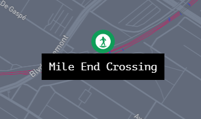
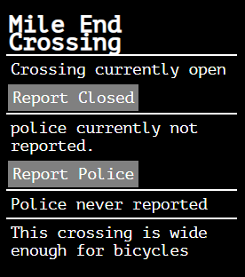
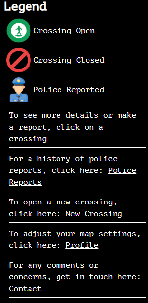

# tracks
<h3>Welcome to tracks - v2!</h3>

This site is a community accessibility project, the purpose of which is to keep track of the status of illegal train track crossings in MTL, Quebec.

Approximately 12,000 people use illegal train track crossings daily on their commute to and from work.

Since the early 2000's, the city and CN rail have been in a political deadlock over whether to build a pedestrian crossing, or a foot bridge.

Instead of either, the response has been to hand out $650 tickets, or shut the holes in the fence, to the detriment of commuters.

This project is intended to encourage political advocacy and promote action to build safe crossings for commuters.

 

This project was built with Mapbox API, with custom markers.

Users can click on their crossing to see more information.

All police reports are logged in a database.
